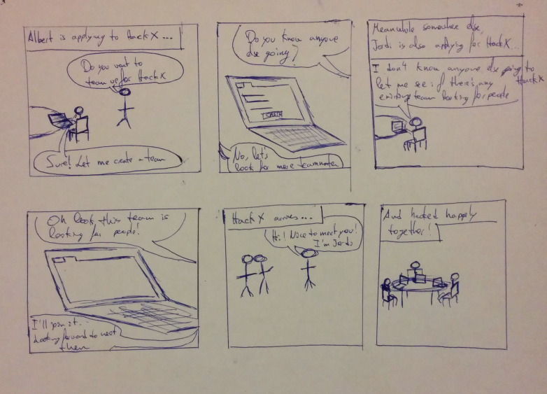

# HackX Registration 

## The prototype

In order to simulate a web enviroment as well as possible I decided to go with [Figma](figma.com) for the prototype. To simulate interactions I linked buttons to generated screens to give the user a feeling that he can interact with the system. 

[Open prototype on Figma](https://www.figma.com/file/PrjeiH5pAaFcIQtlmKck5hcz/HackX-Registration)

### How to build it

To build the prototype and recreate it you need to download the images. You can download them [here](https://github.com/casassg/ucd_assign6/tree/master/assets/img/screens). To simulate interaction you can see the connections here:

[Download this image](assets/img/prototype%20connections.png)

The best way to reproduce the prototype would be to print the screens images and use a **Wizard of Oz** technique following the diagram above to simulate interaction with the user.

## Prototype changes

This are the changes that I introduced to the prototype after finishing the firts usability test on the first prototype.

| Feedback from first prototype       | Changes in new prototype           |
| ------------- |:-------------:| -----:|
| Application status is not obvious | Add status on screen after applying + Moved application update to another screen | 
| Difficult to understand team list order | Added title to team list that says that list is ordered by recentness  |   
| Team comment and contact together can be confusing | Removed comments publicly and only allow for comments on private. Added button to contact team if looking from public screen     |    
| Public/Private team difficult to see | Changed option to a switch on the upper right corner to switch between private and public mode      |    
| Submit application button text is confusing | Changing button text from "Submit application" to "Apply" |

## Story board

Story: Albert is applying to HackX and Noemi asks him to create a team. Meanwhile Jordi applies alone, and sees Albert and Noemi's team. He decides to join their team. At HackX, they meet and start hacking together.

## Video demo

<iframe width="560" height="315" src="https://www.youtube.com/embed/fjKoq70Le8g?rel=0&amp;controls=0&amp;showinfo=0" frameborder="0" allowfullscreen></iframe>

## This page

This page has been made with GitHub Pages in markdown.
